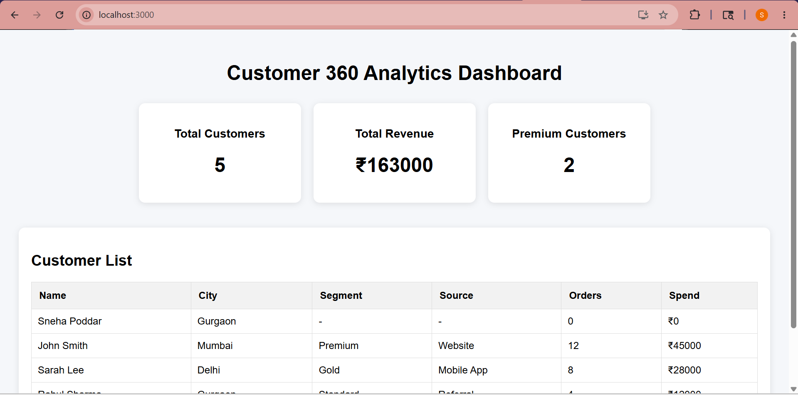
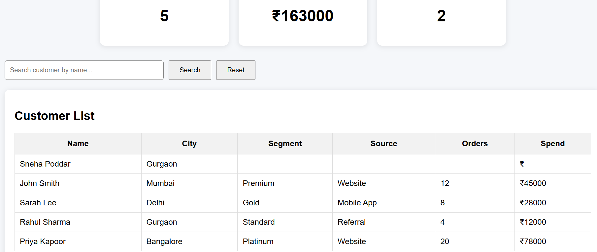
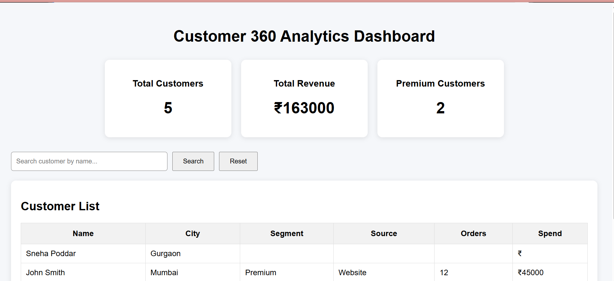
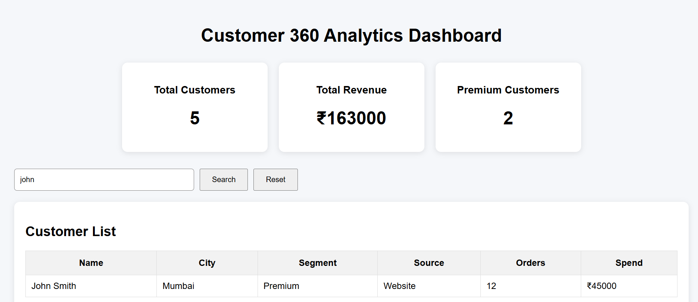
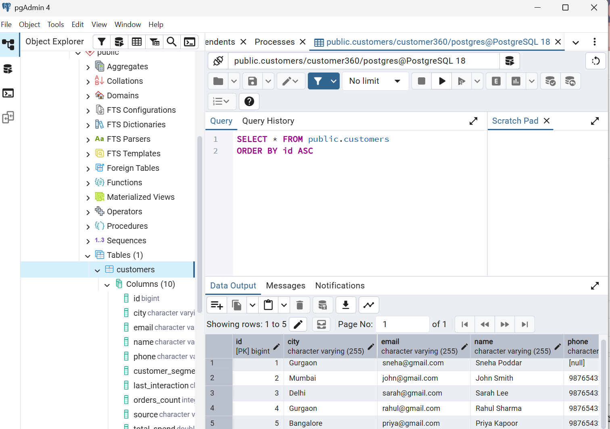

# Customer 360 Analytics Platform

A full-stack Customer 360 Analytics Dashboard built using Spring Boot, React.js, and PostgreSQL. The platform provides customer management, segmentation, search, and revenue analytics through interactive dashboards and REST APIs.

## Features

- Customer Management
- Customer Search & Filtering
- Customer Segmentation
- Revenue Analytics Dashboard
- Interactive Data Visualization
- REST API Integration
- PostgreSQL Database Connectivity

## Tech Stack

### Backend
- Java
- Spring Boot
- Spring Data JPA
- PostgreSQL

### Frontend
- React.js
- Recharts
- JavaScript
- HTML/CSS

## Analytics Included

- Total Customers
- Total Revenue
- Premium Customer Count
- Customer Segment Distribution
- Customer Search & Filtering

## API Endpoints

### Customers

- GET /api/customers
- POST /api/customers
- GET /api/customers/search?name={name}

### Analytics

- GET /api/analytics/customers-count
- GET /api/analytics/total-revenue
- GET /api/analytics/premium-customers
- GET /api/analytics/segment-counts

## Screenshots

### Dashboard Overview

### Customer Analytics Overview

### Customer Search

### Search Results

### Customer Table

## Future Enhancements

- JWT Authentication
- Cloud Deployment (AWS/Render/Vercel)
- Revenue Trend Analysis
- Customer Lifetime Value Analytics
- Export Reports (PDF/Excel)

## Author

**Sneha Poddar**
